# Typography System Design

## Overview

This document outlines the comprehensive typography system for Nexa Manager. The system aims to create a cohesive visual language, improve readability, and enhance the overall user experience by establishing consistent typography rules across all application components.

The typography system will serve as the foundation for text styling throughout the application, ensuring consistency between the sidebar, main content areas, and all UI elements while maintaining brand identity and accessibility standards.

## Architecture

The typography system will be implemented as a set of Tailwind CSS utilities and custom CSS classes that can be applied consistently across the application. The system will be organized into the following components:

1. **Font Families** - Primary and secondary font selections
2. **Type Scale** - A consistent sizing system for all text elements
3. **Font Weights** - Defined weights for different text purposes
4. **Line Heights** - Appropriate spacing for readability
5. **Letter Spacing** - Adjustments for different text sizes and purposes
6. **Text Colors** - A palette aligned with accessibility standards
7. **Responsive Behavior** - Adaptations for different screen sizes

### Integration with Existing Systems

The typography system will integrate with:
- Tailwind CSS configuration
- React component library
- Design tokens system
- Existing UI components

## Components and Interfaces

### Font Selection

**Primary Font: Inter**
- A modern, highly readable sans-serif font
- Excellent for both UI elements and body text
- Strong support for multiple languages
- Available through Google Fonts with good performance

**Secondary Font: Poppins**
- Clean, geometric sans-serif for headings
- Creates clear visual hierarchy when paired with Inter
- Distinctive enough for brand identity while maintaining harmony

### Type Scale

The typography system will use a modular scale with a 1.25 ratio (major third) to create a harmonious progression of sizes:

```
xs:    12px (0.75rem)  - Small labels, footnotes
sm:    14px (0.875rem) - Secondary text, captions
base:  16px (1rem)     - Body text, form inputs
lg:    18px (1.125rem) - Emphasized body text
xl:    20px (1.25rem)  - Subheadings
2xl:   24px (1.5rem)   - H3 headings
3xl:   30px (1.875rem) - H2 headings
4xl:   36px (2.25rem)  - H1 headings
5xl:   48px (3rem)     - Hero headings
```

### Font Weights

```
light:      300 - Specialized use for large headings
regular:    400 - Body text, general UI
medium:     500 - Emphasis, subheadings, labels
semibold:   600 - Primary headings, buttons
bold:       700 - Strong emphasis, key highlights
```

### Line Heights

```
tight:      1.2  - Headings
snug:       1.375 - Subheadings
normal:     1.5  - Body text
relaxed:    1.625 - Large body text
loose:      2    - Specialized content
```

### Letter Spacing

```
tight:      -0.025em - Large headings
normal:     0       - General text
wide:       0.025em - Small caps, labels
wider:      0.05em  - All-caps text
```

### Component-Specific Typography

#### Sidebar Menu Typography

- Font: Inter
- Navigation items: 14px (0.875rem), Medium (500)
- Section headers: 12px (0.75rem), SemiBold (600), uppercase, letter-spacing: wide
- Active item: Medium (500)
- Line height: 1.5 (normal)

#### Main Content Typography

- Headings:
  - H1: Poppins, 36px (2.25rem), SemiBold (600), line-height: tight
  - H2: Poppins, 30px (1.875rem), SemiBold (600), line-height: tight
  - H3: Poppins, 24px (1.5rem), Medium (500), line-height: tight
  - H4: Poppins, 20px (1.25rem), Medium (500), line-height: snug
- Body text: Inter, 16px (1rem), Regular (400), line-height: normal
- Secondary text: Inter, 14px (0.875rem), Regular (400), line-height: normal

#### Button Typography

- Primary buttons: Inter, 14px (0.875rem), Medium (500)
- Secondary buttons: Inter, 14px (0.875rem), Regular (400)
- Small buttons: Inter, 12px (0.75rem), Medium (500)
- Large buttons: Inter, 16px (1rem), Medium (500)

#### Form Element Typography

- Labels: Inter, 14px (0.875rem), Medium (500)
- Input text: Inter, 16px (1rem), Regular (400)
- Helper text: Inter, 14px (0.875rem), Regular (400)
- Error messages: Inter, 14px (0.875rem), Regular (400)

## Data Models

### Typography Token Structure

The typography system will be implemented as a set of design tokens that can be consumed by the application:

```typescript
interface TypographyToken {
  fontFamily: string;
  fontSize: string;
  fontWeight: number | string;
  lineHeight: number | string;
  letterSpacing?: string;
  textTransform?: string;
}

interface TypographySystem {
  headings: {
    h1: TypographyToken;
    h2: TypographyToken;
    h3: TypographyToken;
    h4: TypographyToken;
    h5: TypographyToken;
  };
  body: {
    regular: TypographyToken;
    small: TypographyToken;
    large: TypographyToken;
  };
  ui: {
    button: TypographyToken;
    label: TypographyToken;
    navigation: TypographyToken;
    caption: TypographyToken;
  };
}
```

## Error Handling

The typography system will include fallback fonts to ensure text remains readable even if the primary fonts fail to load:

```css
--font-primary: 'Inter', -apple-system, BlinkMacSystemFont, 'Segoe UI', Roboto, Oxygen, Ubuntu, Cantarell, 'Open Sans', 'Helvetica Neue', sans-serif;
--font-secondary: 'Poppins', -apple-system, BlinkMacSystemFont, 'Segoe UI', Roboto, Oxygen, Ubuntu, Cantarell, 'Open Sans', 'Helvetica Neue', sans-serif;
```

## Testing Strategy

The typography system will be tested through:

1. **Visual Regression Testing**
   - Compare screenshots before and after implementation
   - Ensure consistency across components

2. **Accessibility Testing**
   - Verify contrast ratios meet WCAG 2.1 AA standards
   - Test with screen readers to ensure proper semantic structure

3. **Responsive Testing**
   - Verify typography scales appropriately across breakpoints
   - Test on various devices and screen sizes

4. **Cross-Browser Testing**
   - Ensure consistent rendering across major browsers
   - Verify font loading and fallbacks work correctly

## Implementation Considerations

### Tailwind CSS Configuration

The typography system will be implemented in the Tailwind configuration:

```javascript
// tailwind.config.js
module.exports = {
  theme: {
    extend: {
      fontFamily: {
        primary: ['Inter', 'sans-serif'],
        secondary: ['Poppins', 'sans-serif'],
      },
      fontSize: {
        'xs': ['0.75rem', { lineHeight: '1rem' }],
        'sm': ['0.875rem', { lineHeight: '1.25rem' }],
        'base': ['1rem', { lineHeight: '1.5rem' }],
        'lg': ['1.125rem', { lineHeight: '1.75rem' }],
        'xl': ['1.25rem', { lineHeight: '1.75rem' }],
        '2xl': ['1.5rem', { lineHeight: '2rem' }],
        '3xl': ['1.875rem', { lineHeight: '2.25rem' }],
        '4xl': ['2.25rem', { lineHeight: '2.5rem' }],
        '5xl': ['3rem', { lineHeight: '1' }],
      },
      fontWeight: {
        light: 300,
        normal: 400,
        medium: 500,
        semibold: 600,
        bold: 700,
      },
      letterSpacing: {
        tight: '-0.025em',
        normal: '0',
        wide: '0.025em',
        wider: '0.05em',
      },
      lineHeight: {
        tight: '1.2',
        snug: '1.375',
        normal: '1.5',
        relaxed: '1.625',
        loose: '2',
      },
    },
  },
};
```

### CSS Custom Properties

For components that require more specific styling, CSS custom properties will be defined:

```css
:root {
  /* Font families */
  --font-primary: 'Inter', sans-serif;
  --font-secondary: 'Poppins', sans-serif;
  
  /* Font sizes */
  --font-size-xs: 0.75rem;
  --font-size-sm: 0.875rem;
  --font-size-base: 1rem;
  --font-size-lg: 1.125rem;
  --font-size-xl: 1.25rem;
  --font-size-2xl: 1.5rem;
  --font-size-3xl: 1.875rem;
  --font-size-4xl: 2.25rem;
  --font-size-5xl: 3rem;
  
  /* Line heights */
  --line-height-tight: 1.2;
  --line-height-snug: 1.375;
  --line-height-normal: 1.5;
  --line-height-relaxed: 1.625;
  --line-height-loose: 2;
  
  /* Font weights */
  --font-weight-light: 300;
  --font-weight-regular: 400;
  --font-weight-medium: 500;
  --font-weight-semibold: 600;
  --font-weight-bold: 700;
  
  /* Letter spacing */
  --letter-spacing-tight: -0.025em;
  --letter-spacing-normal: 0;
  --letter-spacing-wide: 0.025em;
  --letter-spacing-wider: 0.05em;
}
```

### Responsive Considerations

The typography system will include responsive adjustments for different screen sizes:

```css
/* Base typography (mobile first) */
h1 {
  font-size: var(--font-size-3xl);
}

/* Tablet and above */
@media (min-width: 768px) {
  h1 {
    font-size: var(--font-size-4xl);
  }
}

/* Desktop and above */
@media (min-width: 1024px) {
  h1 {
    font-size: var(--font-size-5xl);
  }
}
```

### Typography Utility Classes

A set of utility classes will be created to easily apply typography styles:

```css
.text-heading-1 {
  font-family: var(--font-secondary);
  font-size: var(--font-size-4xl);
  font-weight: var(--font-weight-semibold);
  line-height: var(--line-height-tight);
  letter-spacing: var(--letter-spacing-tight);
}

.text-body {
  font-family: var(--font-primary);
  font-size: var(--font-size-base);
  font-weight: var(--font-weight-regular);
  line-height: var(--line-height-normal);
  letter-spacing: var(--letter-spacing-normal);
}

/* Additional utility classes for other text styles */
```

## Visual Examples

```mermaid
graph TD
    A[Typography System] --> B[Font Families]
    A --> C[Type Scale]
    A --> D[Font Weights]
    A --> E[Line Heights]
    A --> F[Letter Spacing]
    
    B --> B1[Primary: Inter]
    B --> B2[Secondary: Poppins]
    
    C --> C1[xs: 12px]
    C --> C2[sm: 14px]
    C --> C3[base: 16px]
    C --> C4[lg: 18px]
    C --> C5[xl: 20px]
    C --> C6[2xl: 24px]
    C --> C7[3xl: 30px]
    C --> C8[4xl: 36px]
    C --> C9[5xl: 48px]
    
    D --> D1[light: 300]
    D --> D2[regular: 400]
    D --> D3[medium: 500]
    D --> D4[semibold: 600]
    D --> D5[bold: 700]
    
    E --> E1[tight: 1.2]
    E --> E2[snug: 1.375]
    E --> E3[normal: 1.5]
    E --> E4[relaxed: 1.625]
    E --> E5[loose: 2]
    
    F --> F1[tight: -0.025em]
    F --> F2[normal: 0]
    F --> F3[wide: 0.025em]
    F --> F4[wider: 0.05em]
```

