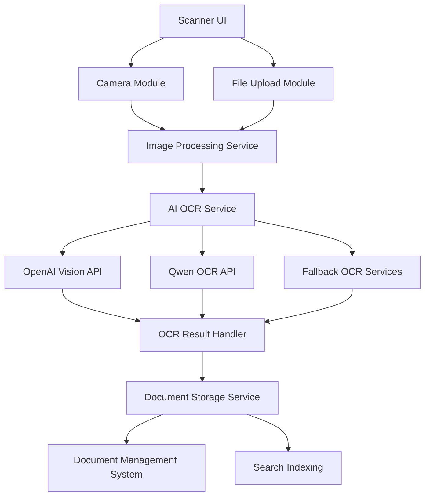

# Design Document: Document Scanner with AI-Powered OCR

## Overview

The Document Scanner feature will provide Nexa Manager users with a seamless way to digitize physical documents using their device's camera or by uploading existing images. The system will process these documents and extract text using advanced AI-powered OCR (Optical Character Recognition) APIs, including OpenAI Vision API, Qwen OCR API, and other OCR services.

This design document outlines the architecture, components, interfaces, data models, and implementation strategy for the AI-powered Document Scanner feature with a focus on OCR functionality.

## Architecture

The Document Scanner feature will follow a modular architecture that integrates with the existing Nexa Manager system, with a focus on AI-powered OCR capabilities:



### Key Components

1. **Scanner UI** - The user interface for document scanning and uploading with loading states and user feedback
2. **Camera Module** - Handles device camera access and image capture
3. **File Upload Module** - Manages file selection and upload (PNG, JPG, PDF)
4. **Image Processing Service** - Preprocesses images for optimal OCR results (format conversion, resolution optimization)
5. **AI OCR Service** - Orchestrates OCR requests to multiple AI providers
   - OpenAI Vision API Integration
   - Qwen OCR API Integration
   - Fallback OCR Services
6. **OCR Result Handler** - Processes and formats OCR results
7. **Document Storage Service** - Stores and manages document files
8. **Document Management System** - Organizes documents with metadata
9. **Search Indexing** - Indexes extracted text for search

## Components and Interfaces

### Scanner UI Component

The Scanner UI will be implemented as a React component with the following features:

- Tab-based interface for switching between camera and upload modes
- Camera viewfinder with document edge detection
- File selection and drag-and-drop upload area
- Document preview and editing interface
- OCR results display and editing
- Document metadata form
- Progress indicators for processing steps

```typescript
// Component Interface
interface ScannerProps {
  onDocumentProcessed: (document: ProcessedDocument) => void;
  defaultCategory?: string;
  clientId?: string;
  projectId?: string;
}
```

### Camera Module

The Camera module will handle device camera access using the Web API:

```typescript
// Camera Service Interface
interface CameraService {
  initialize(): Promise<boolean>;
  startCamera(): Promise<MediaStream>;
  stopCamera(): void;
  captureImage(): Promise<Blob>;
  hasCamera(): boolean;
  requestPermission(): Promise<PermissionState>;
}
```

### File Upload Module

The File Upload module will handle file selection and validation:

```typescript
// File Upload Service Interface
interface FileUploadService {
  validateFile(file: File): boolean;
  processFiles(files: File[]): Promise<ProcessedFile[]>;
  getAcceptedFileTypes(): string[];
  getMaxFileSize(): number;
}

interface ProcessedFile {
  id: string;
  originalFile: File;
  preview: string;
  size: number;
  type: string;
  name: string;
  error?: string;
}
```

### Image Processing Service

The Image Processing service will handle document image enhancement:

```typescript
// Image Processing Service Interface
interface ImageProcessingService {
  enhanceImage(image: Blob): Promise<EnhancedImage>;
  detectDocumentEdges(image: Blob): Promise<DocumentBounds>;
  cropToDocument(image: Blob, bounds: DocumentBounds): Promise<Blob>;
  adjustContrast(image: Blob, level: number): Promise<Blob>;
  adjustBrightness(image: Blob, level: number): Promise<Blob>;
  removeShadows(image: Blob): Promise<Blob>;
  convertToPDF(images: Blob[]): Promise<Blob>;
}

interface EnhancedImage {
  original: Blob;
  enhanced: Blob;
  width: number;
  height: number;
}

interface DocumentBounds {
  topLeft: Point;
  topRight: Point;
  bottomLeft: Point;
  bottomRight: Point;
}

interface Point {
  x: number;
  y: number;
}
```

### AI OCR Service

The AI OCR service will extract text from document images using multiple AI providers:

```typescript
// AI OCR Service Interface
interface AIOCRService {
  extractText(image: Blob, options?: OCROptions): Promise<OCRResult>;
  getAvailableProviders(): OCRProvider[];
  setPreferredProvider(provider: OCRProvider): void;
  getProviderStatus(provider: OCRProvider): ProviderStatus;
}

enum OCRProvider {
  OpenAI = 'openai',
  Qwen = 'qwen',
  Azure = 'azure',
  Google = 'google',
  Fallback = 'fallback'
}

interface OCROptions {
  provider?: OCRProvider;
  enhanceImage?: boolean;
  detectTables?: boolean;
  language?: string;
  timeout?: number;
  maxRetries?: number;
}

interface OCRResult {
  text: string;
  confidence: number;
  provider: OCRProvider;
  processingTime: number;
  blocks?: TextBlock[];
  tables?: TableData[];
  rawResponse?: any;
  error?: OCRError;
}

interface TextBlock {
  text: string;
  bounds?: Rect;
  confidence?: number;
}

interface TableData {
  rows: number;
  columns: number;
  cells: TableCell[][];
}

interface TableCell {
  text: string;
  rowSpan?: number;
  colSpan?: number;
}

interface Rect {
  x: number;
  y: number;
  width: number;
  height: number;
}

interface OCRError {
  code: string;
  message: string;
  provider: OCRProvider;
  retryable: boolean;
}

interface ProviderStatus {
  available: boolean;
  quotaRemaining?: number;
  rateLimited: boolean;
  lastError?: string;
}

// OpenAI Vision API Implementation
class OpenAIVisionOCR implements OCRProvider {
  async extractText(image: Blob): Promise<OCRResult>;
  getStatus(): ProviderStatus;
  getQuotaRemaining(): number;
}

// Qwen OCR API Implementation
class QwenOCR implements OCRProvider {
  async extractText(image: Blob): Promise<OCRResult>;
  getStatus(): ProviderStatus;
  getQuotaRemaining(): number;
}

// OCR Provider Factory
class OCRProviderFactory {
  static getProvider(provider: OCRProvider): OCRProvider;
  static getFallbackProvider(): OCRProvider;
}
```

### OCR Result Handler

The OCR Result Handler will process and format the results from AI OCR services:

```typescript
interface OCRResultHandler {
  formatText(result: OCRResult): string;
  mergeResults(results: OCRResult[]): OCRResult;
  extractStructuredData(result: OCRResult): StructuredData;
  getFormattedHTML(result: OCRResult): string;
}

interface StructuredData {
  title?: string;
  date?: Date;
  amount?: number;
  entities?: NamedEntity[];
  keyValuePairs?: Record<string, string>;
}

interface NamedEntity {
  text: string;
  type: string;
  confidence: number;
}
```

### Document Storage Service

The Document Storage service will manage document files:

```typescript
// Document Storage Service Interface
interface DocumentStorageService {
  saveDocument(document: ProcessedDocument): Promise<string>;
  getDocument(id: string): Promise<ProcessedDocument>;
  deleteDocument(id: string): Promise<boolean>;
  updateDocument(id: string, updates: Partial<ProcessedDocument>): Promise<ProcessedDocument>;
  listDocuments(filters: DocumentFilters): Promise<DocumentListResult>;
}

interface DocumentFilters {
  category?: string;
  clientId?: string;
  projectId?: string;
  tags?: string[];
  dateRange?: DateRange;
  searchText?: string;
  page?: number;
  pageSize?: number;
}

interface DocumentListResult {
  documents: ProcessedDocument[];
  totalCount: number;
  page: number;
  pageSize: number;
}
```

## Data Models

### ProcessedDocument

The core data model for scanned documents:

```typescript
interface ProcessedDocument {
  id: string;
  title: string;
  description?: string;
  category: string;
  tags: string[];
  clientId?: string;
  projectId?: string;
  createdAt: Date;
  updatedAt: Date;
  createdBy: string;
  originalFile: {
    url: string;
    name: string;
    size: number;
    type: string;
  };
  enhancedFile: {
    url: string;
    size: number;
  };
  pdfFile?: {
    url: string;
    size: number;
  };
  textContent: string;
  ocrConfidence: number;
  ocrLanguage: string;
  status: DocumentStatus;
  processingErrors?: string[];
  sharingSettings: SharingSettings;
  accessLog: AccessLogEntry[];
}

enum DocumentStatus {
  Processing = 'processing',
  Complete = 'complete',
  Error = 'error'
}

interface SharingSettings {
  isShared: boolean;
  accessLevel: AccessLevel;
  sharedWith: SharedUser[];
  publicLink?: string;
  expiresAt?: Date;
}

enum AccessLevel {
  View = 'view',
  Edit = 'edit',
  Download = 'download'
}

interface SharedUser {
  userId: string;
  email: string;
  accessLevel: AccessLevel;
  sharedAt: Date;
}

interface AccessLogEntry {
  userId: string;
  action: string;
  timestamp: Date;
  ipAddress?: string;
}
```

## Error Handling

The Document Scanner feature will implement comprehensive error handling:

1. **Camera Access Errors**
   - Permission denied: Prompt user to enable camera permissions
   - No camera available: Automatically switch to file upload mode
   - Camera initialization failure: Display troubleshooting steps

2. **File Upload Errors**
   - File size exceeded: Display error with size limits
   - Unsupported file type: Show supported formats
   - Upload failure: Retry mechanism with exponential backoff

3. **Processing Errors**
   - Image enhancement failure: Fallback to original image
   - OCR failure: Allow manual text entry
   - Storage errors: Local caching with retry mechanism

4. **Network Errors**
   - Connection loss: Queue operations for retry when online
   - Timeout: Implement request timeout with retry options
   - Server errors: Display user-friendly error messages

## Testing Strategy

The Document Scanner feature will be tested using the following approaches:

1. **Unit Tests**
   - Test individual services and components in isolation
   - Mock external dependencies (camera, file system)
   - Test error handling and edge cases

2. **Integration Tests**
   - Test interaction between components
   - Verify data flow through the system
   - Test integration with document management system

3. **End-to-End Tests**
   - Test complete user workflows
   - Verify document scanning, processing, and storage
   - Test sharing and collaboration features

4. **Performance Tests**
   - Measure processing time for different document sizes
   - Test with large batches of documents
   - Verify resource usage during processing

5. **Accessibility Tests**
   - Ensure scanner UI is accessible
   - Test keyboard navigation
   - Verify screen reader compatibility

## Security Considerations

1. **Data Protection**
   - Encrypt documents in transit and at rest
   - Implement secure access controls
   - Sanitize extracted text for XSS prevention

2. **Permission Management**
   - Enforce document access permissions
   - Audit access to sensitive documents
   - Implement principle of least privilege

3. **Privacy**
   - Process documents client-side when possible
   - Clear temporary files after processing
   - Respect user privacy settings

## Implementation Approach

The Document Scanner feature will be implemented using the following technologies:

1. **Frontend**
   - React components with TypeScript
   - TailwindCSS for styling
   - React Hook Form for metadata input
   - Framer Motion for transitions and animations
   - Loading states and progress indicators for OCR processing

2. **Image Processing**
   - Browser Canvas API for image preprocessing
   - Image compression and format conversion
   - Resolution optimization for API requirements
   - PDF.js for PDF handling and extraction

3. **AI-Powered OCR**
   - OpenAI Vision API integration for high-quality text extraction
   - Qwen OCR API as an alternative provider
   - Azure Computer Vision or Google Cloud Vision as additional options
   - Provider fallback mechanism with automatic retry
   - Rate limiting and quota management

4. **Storage and Security**
   - Secure temporary storage for uploaded images
   - Encryption for sensitive document content
   - Supabase storage for processed documents
   - PostgreSQL for metadata and relationships
   - Full-text search indexing for extracted content

5. **API Integration**
   - Axios for API requests with interceptors
   - Request queuing and rate limiting
   - Error handling and retry mechanisms
   - Response caching for optimization

## API Cost and Rate Limiting Considerations

1. **Cost Optimization**
   - Image preprocessing to reduce size before API calls
   - Caching of OCR results for identical documents
   - Batch processing for multiple pages
   - Provider selection based on document complexity and cost

2. **Rate Limiting**
   - Implement token bucket algorithm for API request throttling
   - Queue requests during high traffic periods
   - Monitor quota usage and provide user feedback
   - Graceful degradation when limits are reached

3. **Fallback Strategy**
   - Primary/secondary provider configuration
   - Automatic fallback to alternative providers
   - Local processing for simple documents when possible
   - User notification when fallbacks are used