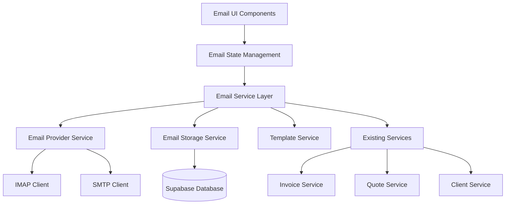

# Email Management System Design

## Overview

The Email Management System will transform the existing mock Email page into a fully functional email client integrated with Nexa Manager's business operations. The system will provide comprehensive email functionality while leveraging existing services and maintaining the current UI design patterns.

## Architecture

### High-Level Architecture



### Service Integration

The email system will integrate with existing Nexa Manager services:
- **Invoice Service**: For sending invoice emails with PDF attachments
- **Quote Service**: For sending quote emails and reminders
- **Client Service**: For client-specific email history and templates
- **PDF Services**: For generating and attaching business documents

## Components and Interfaces

### Core Components

#### 1. Email Page Component (Enhanced)
- **Location**: `web-app/src/pages/Email.jsx`
- **Purpose**: Main email interface with real data integration
- **Key Features**:
  - Real-time email synchronization
  - Folder and label management
  - Email composition with rich text editor
  - Template integration
  - Search and filtering

#### 2. Email Service Layer
- **Location**: `web-app/src/lib/emailManagementService.js`
- **Purpose**: Core email operations and business logic
- **Key Methods**:
  ```javascript
  class EmailManagementService {
    // Email CRUD operations
    async fetchEmails(folderId, filters = {})
    async sendEmail(emailData)
    async deleteEmail(emailId)
    async markAsRead(emailId, isRead)
    async starEmail(emailId, isStarred)
    
    // Folder and label management
    async createFolder(folderData)
    async applyLabel(emailId, labelId)
    async removeLabel(emailId, labelId)
    
    // Template operations
    async getTemplates(category)
    async saveTemplate(templateData)
    async applyTemplate(templateId, variables)
    
    // Search and filtering
    async searchEmails(query, filters)
    async getEmailsByClient(clientId)
    
    // Integration methods
    async sendInvoiceEmail(invoiceId, recipientEmail, templateId)
    async sendQuoteEmail(quoteId, recipientEmail, templateId)
  }
  ```

#### 3. Email Provider Service
- **Location**: `web-app/src/lib/emailProviderService.js`
- **Purpose**: Handle IMAP/SMTP connections and email synchronization
- **Key Features**:
  - Multiple email account support
  - IMAP email fetching and synchronization
  - SMTP email sending
  - Connection management and error handling

#### 4. Email Storage Service
- **Location**: `web-app/src/lib/emailStorageService.js`
- **Purpose**: Database operations for email data
- **Key Features**:
  - Email metadata storage
  - Attachment handling
  - Search indexing
  - Data encryption

#### 5. Email Components Library
- **Location**: `web-app/src/components/email/`
- **Components**:
  - `EmailComposer.jsx`: Rich text email composition
  - `EmailList.jsx`: Email list with virtual scrolling
  - `EmailViewer.jsx`: Email content display
  - `TemplateManager.jsx`: Template creation and management
  - `EmailSettings.jsx`: Email account configuration
  - `AttachmentHandler.jsx`: File attachment management

### State Management

#### Email Context
```javascript
const EmailContext = {
  // Email data
  emails: [],
  selectedEmail: null,
  folders: [],
  labels: [],
  templates: [],
  
  // UI state
  isLoading: false,
  selectedFolder: 'inbox',
  searchQuery: '',
  filters: {},
  
  // Actions
  fetchEmails: () => {},
  selectEmail: () => {},
  sendEmail: () => {},
  deleteEmail: () => {},
  // ... other actions
}
```

#### Custom Hooks
- `useEmails()`: Email data management
- `useEmailComposer()`: Email composition logic
- `useEmailTemplates()`: Template management
- `useEmailSearch()`: Search and filtering
- `useEmailSync()`: Real-time synchronization

## Data Models

### Email Model
```typescript
interface Email {
  id: string;
  messageId: string;
  threadId?: string;
  folderId: string;
  subject: string;
  sender: {
    name: string;
    email: string;
  };
  recipients: {
    to: EmailAddress[];
    cc?: EmailAddress[];
    bcc?: EmailAddress[];
  };
  content: {
    text: string;
    html?: string;
  };
  attachments: Attachment[];
  labels: string[];
  isRead: boolean;
  isStarred: boolean;
  isImportant: boolean;
  receivedAt: Date;
  sentAt?: Date;
  clientId?: string;
  relatedDocuments?: {
    type: 'invoice' | 'quote' | 'contract';
    id: string;
  }[];
}
```

### Folder Model
```typescript
interface Folder {
  id: string;
  name: string;
  type: 'system' | 'custom';
  icon?: string;
  color?: string;
  unreadCount: number;
  totalCount: number;
  parentId?: string;
}
```

### Template Model
```typescript
interface EmailTemplate {
  id: string;
  name: string;
  category: string;
  subject: string;
  content: {
    text: string;
    html?: string;
  };
  variables: TemplateVariable[];
  isSystem: boolean;
  createdAt: Date;
  updatedAt: Date;
}
```

### Database Schema

#### emails table
```sql
CREATE TABLE emails (
  id UUID PRIMARY KEY DEFAULT gen_random_uuid(),
  message_id VARCHAR UNIQUE NOT NULL,
  thread_id VARCHAR,
  folder_id UUID REFERENCES folders(id),
  subject TEXT NOT NULL,
  sender_name VARCHAR NOT NULL,
  sender_email VARCHAR NOT NULL,
  recipients JSONB NOT NULL,
  content_text TEXT,
  content_html TEXT,
  attachments JSONB DEFAULT '[]',
  labels JSONB DEFAULT '[]',
  is_read BOOLEAN DEFAULT FALSE,
  is_starred BOOLEAN DEFAULT FALSE,
  is_important BOOLEAN DEFAULT FALSE,
  received_at TIMESTAMP WITH TIME ZONE NOT NULL,
  sent_at TIMESTAMP WITH TIME ZONE,
  client_id UUID REFERENCES clients(id),
  related_documents JSONB DEFAULT '[]',
  created_at TIMESTAMP WITH TIME ZONE DEFAULT NOW(),
  updated_at TIMESTAMP WITH TIME ZONE DEFAULT NOW()
);
```

#### folders table
```sql
CREATE TABLE folders (
  id UUID PRIMARY KEY DEFAULT gen_random_uuid(),
  name VARCHAR NOT NULL,
  type VARCHAR CHECK (type IN ('system', 'custom')) DEFAULT 'custom',
  icon VARCHAR,
  color VARCHAR,
  parent_id UUID REFERENCES folders(id),
  user_id UUID REFERENCES auth.users(id),
  created_at TIMESTAMP WITH TIME ZONE DEFAULT NOW()
);
```

#### email_templates table
```sql
CREATE TABLE email_templates (
  id UUID PRIMARY KEY DEFAULT gen_random_uuid(),
  name VARCHAR NOT NULL,
  category VARCHAR NOT NULL,
  subject TEXT NOT NULL,
  content_text TEXT NOT NULL,
  content_html TEXT,
  variables JSONB DEFAULT '[]',
  is_system BOOLEAN DEFAULT FALSE,
  user_id UUID REFERENCES auth.users(id),
  created_at TIMESTAMP WITH TIME ZONE DEFAULT NOW(),
  updated_at TIMESTAMP WITH TIME ZONE DEFAULT NOW()
);
```

## Error Handling

### Error Categories
1. **Connection Errors**: IMAP/SMTP connection failures
2. **Authentication Errors**: Invalid credentials or expired tokens
3. **Validation Errors**: Invalid email formats or missing required fields
4. **Storage Errors**: Database operation failures
5. **Attachment Errors**: File size limits or unsupported formats

### Error Handling Strategy
```javascript
class EmailError extends Error {
  constructor(message, type, details = {}) {
    super(message);
    this.type = type;
    this.details = details;
    this.timestamp = new Date();
  }
}

// Error types
const ERROR_TYPES = {
  CONNECTION_FAILED: 'CONNECTION_FAILED',
  AUTHENTICATION_FAILED: 'AUTHENTICATION_FAILED',
  VALIDATION_ERROR: 'VALIDATION_ERROR',
  STORAGE_ERROR: 'STORAGE_ERROR',
  ATTACHMENT_ERROR: 'ATTACHMENT_ERROR'
};
```

### Retry Logic
- Implement exponential backoff for connection retries
- Queue failed email sends for retry
- Graceful degradation when email services are unavailable

## Testing Strategy

### Unit Tests
- **Email Service**: Test all CRUD operations and business logic
- **Email Provider**: Test IMAP/SMTP connections with mocked servers
- **Email Storage**: Test database operations with test database
- **Components**: Test UI components with React Testing Library

### Integration Tests
- **Email Flow**: Test complete email send/receive workflows
- **Template System**: Test template application and variable substitution
- **Business Integration**: Test invoice/quote email integration
- **Synchronization**: Test real-time email sync

### End-to-End Tests
- **User Workflows**: Test complete user journeys with Playwright
- **Email Composition**: Test email creation and sending
- **Email Management**: Test folder organization and search
- **Template Usage**: Test template selection and customization

### Performance Tests
- **Large Email Lists**: Test performance with thousands of emails
- **Search Performance**: Test search response times
- **Synchronization Load**: Test sync performance under load
- **Memory Usage**: Monitor memory consumption during operations

## Security Considerations

### Data Protection
- **Encryption**: Encrypt email content and attachments at rest
- **Transmission Security**: Use TLS for all email communications
- **Access Control**: Implement role-based access to email features
- **Data Retention**: Comply with data retention policies

### Authentication & Authorization
- **Email Account Security**: Secure storage of email credentials
- **Session Management**: Proper session handling for email access
- **API Security**: Secure email service API endpoints
- **Audit Logging**: Log all email operations for compliance

### Privacy Compliance
- **GDPR Compliance**: Handle personal data in emails appropriately
- **Data Minimization**: Store only necessary email metadata
- **Right to Deletion**: Support email deletion requests
- **Consent Management**: Handle email consent for marketing communications

## Performance Optimization

### Email Loading
- **Virtual Scrolling**: Implement virtual scrolling for large email lists
- **Lazy Loading**: Load email content on demand
- **Caching Strategy**: Cache frequently accessed emails
- **Pagination**: Implement server-side pagination for email lists

### Search Optimization
- **Full-Text Search**: Implement efficient full-text search
- **Search Indexing**: Create appropriate database indexes
- **Search Caching**: Cache common search results
- **Faceted Search**: Support multiple search filters

### Synchronization
- **Incremental Sync**: Only sync new/changed emails
- **Background Sync**: Sync emails in background workers
- **Conflict Resolution**: Handle sync conflicts gracefully
- **Offline Support**: Support basic email operations offline