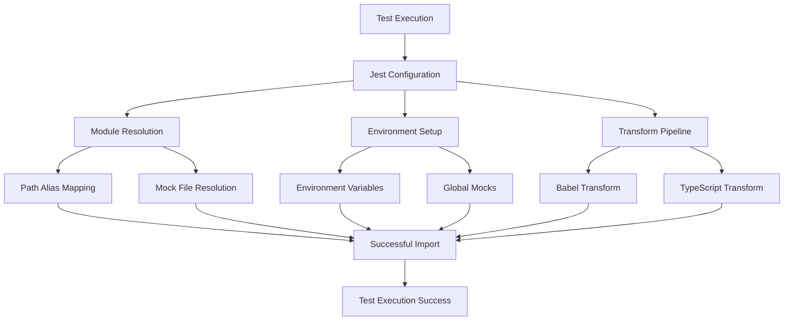

# Test Fixing Design Document

## Overview

The test suite is currently failing due to multiple configuration and dependency issues. This design outlines a systematic approach to fix all 80 failing test suites by addressing the root causes: module resolution, missing dependencies, environment configuration, and ES module compatibility.

The solution involves updating Jest configuration, creating missing mock files, fixing path aliases, and ensuring proper test environment setup.

## Architecture

### Problem Categories

1. **Module Resolution Issues (40+ failures)**
   - Path aliases not resolving correctly (`@/`, `@lib/`, `@components/`)
   - Missing files that tests are trying to import
   - Incorrect module mapping in Jest configuration

2. **Environment Configuration Issues (20+ failures)**
   - Missing Supabase environment variables
   - `import.meta.env` syntax not supported in Jest
   - WebSocket and other environment-specific configurations

3. **Missing Dependencies (15+ failures)**
   - Service files that don't exist but are imported by tests
   - Component files missing from expected locations
   - Utility modules not found

4. **ES Module Compatibility (5+ failures)**
   - `import.meta` syntax causing syntax errors
   - Module type conflicts between ESM and CommonJS

### Solution Architecture



## Components and Interfaces

### 1. Jest Configuration Updates

**File**: `.config/jest/jest.config.cjs`

**Updates Needed**:
- Fix module name mapping for all path aliases
- Add proper transform configuration for ES modules
- Update environment variable handling
- Add missing mock file mappings

**Key Changes**:
```javascript
moduleNameMapper: {
  // Fix path alias resolution
  '^@/(.*)$': '<rootDir>/src/$1',
  '^@lib/(.*)$': '<rootDir>/src/lib/$1',
  '^@components/(.*)$': '<rootDir>/src/components/$1',
  '^@services/(.*)$': '<rootDir>/src/services/$1',
  '^@utils/(.*)$': '<rootDir>/src/utils/$1',
  
  // Add missing service mocks
  '^.*/(\\w+Service)$': '<rootDir>/src/shared/__tests__/mocks/services/$1.js',
}
```

### 2. Missing Mock Files Creation

**Location**: `web-app/src/shared/__tests__/mocks/`

**Files to Create**:
- Service mocks for missing services
- Component mocks for missing components
- Utility mocks for missing utilities
- Provider mocks for React contexts

**Mock Structure**:
```javascript
// Generic service mock template
export default {
  // Common service methods
  get: jest.fn(() => Promise.resolve({ data: [], error: null })),
  create: jest.fn(() => Promise.resolve({ data: {}, error: null })),
  update: jest.fn(() => Promise.resolve({ data: {}, error: null })),
  delete: jest.fn(() => Promise.resolve({ data: {}, error: null })),
};
```

### 3. Environment Configuration

**File**: `.config/jest/jest.setup.js`

**Enhancements**:
- Proper `import.meta` polyfill
- Complete environment variable setup
- Global mock definitions
- Error handling improvements

### 4. Transform Configuration

**Babel Configuration**:
- Add `babel-plugin-transform-import-meta` for `import.meta` support
- Ensure proper ES module to CommonJS transformation
- Handle TypeScript and JSX transforms correctly

### 5. Path Resolution System

**TypeScript Configuration Alignment**:
- Ensure Jest moduleNameMapper matches tsconfig.json paths
- Handle both legacy and new path structures
- Support feature-based imports

## Data Models

### Test Configuration Model

```typescript
interface TestConfig {
  moduleNameMapper: Record<string, string>;
  transform: Record<string, string | [string, object]>;
  setupFiles: string[];
  setupFilesAfterEnv: string[];
  testEnvironment: string;
  globals: Record<string, any>;
}
```

### Mock Service Model

```typescript
interface MockService {
  [key: string]: jest.MockedFunction<any>;
}

interface ServiceMock {
  default: MockService;
  [namedExport: string]: any;
}
```

### Environment Model

```typescript
interface TestEnvironment {
  VITE_SUPABASE_URL: string;
  VITE_SUPABASE_ANON_KEY: string;
  VITE_APP_ENV: string;
  VITE_BASE_URL: string;
  NODE_ENV: string;
  MODE: string;
}
```

## Error Handling

### 1. Module Resolution Errors

**Strategy**: Comprehensive mock mapping
- Create fallback mocks for missing modules
- Use Jest's module name mapping to redirect imports
- Provide meaningful error messages for unmapped modules

### 2. Environment Variable Errors

**Strategy**: Complete environment setup
- Mock all required environment variables
- Provide fallback values for missing variables
- Handle both `process.env` and `import.meta.env` access patterns

### 3. Import Syntax Errors

**Strategy**: Transform pipeline enhancement
- Use Babel plugins to transform modern syntax
- Handle `import.meta` with proper polyfills
- Ensure consistent module format across tests

### 4. Missing Dependency Errors

**Strategy**: Progressive mock creation
- Create mocks for all missing services
- Implement component mocks for missing UI components
- Provide utility mocks for missing helper functions

## Testing Strategy

### 1. Incremental Fixing Approach

1. **Phase 1**: Fix Jest configuration and basic module resolution
2. **Phase 2**: Create missing mock files for services
3. **Phase 3**: Fix environment and import.meta issues
4. **Phase 4**: Address remaining component and utility mocks
5. **Phase 5**: Validate all tests pass and optimize

### 2. Validation Strategy

- Run tests in batches to identify remaining issues
- Use Jest's `--verbose` flag to get detailed error information
- Implement test categorization for easier debugging
- Create test health monitoring

### 3. Mock Quality Assurance

- Ensure mocks match actual service interfaces
- Provide realistic mock data for better test reliability
- Implement mock validation to catch interface changes
- Document mock behavior for maintainability

## Implementation Phases

### Phase 1: Core Configuration (Priority: Critical)
- Update Jest configuration file
- Fix basic path alias resolution
- Set up proper environment variables

### Phase 2: Service Mocks (Priority: High)
- Create missing service mocks
- Implement provider mocks
- Add utility function mocks

### Phase 3: Component Mocks (Priority: Medium)
- Create missing component mocks
- Implement React context mocks
- Add hook mocks

### Phase 4: Advanced Features (Priority: Low)
- Optimize test performance
- Add test utilities
- Implement test categorization

## Success Metrics

- **Test Pass Rate**: Target 95%+ (from current ~18%)
- **Test Execution Time**: Under 30 seconds for full suite
- **Configuration Errors**: Zero module resolution errors
- **Environment Errors**: Zero environment variable errors
- **Maintainability**: Clear mock structure and documentation