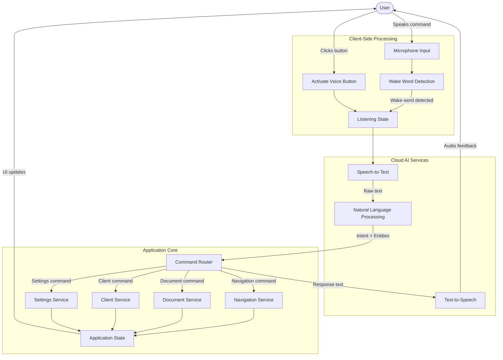
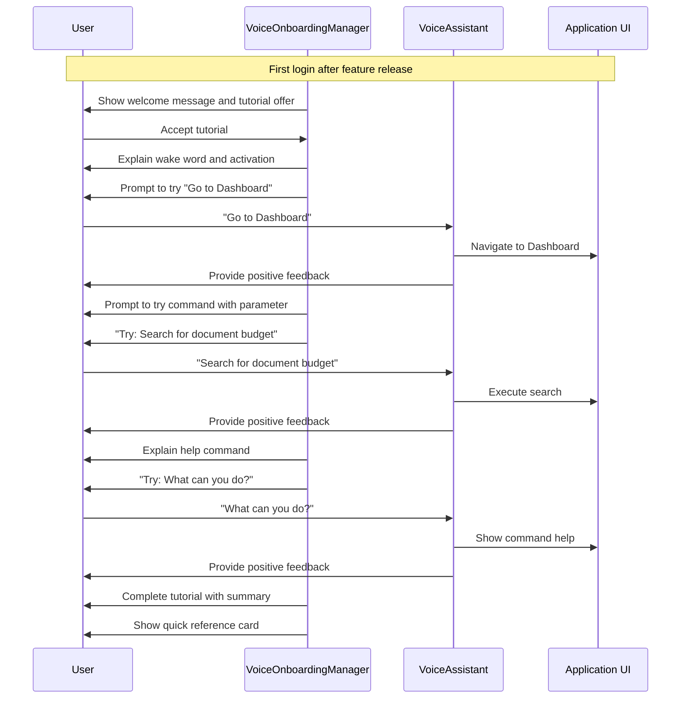
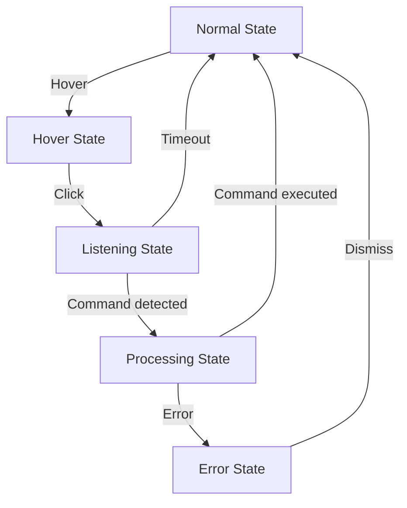

# Design Document: Voice Assistant

## Overview

The Voice Assistant feature will add voice command capabilities to Nexa Manager, allowing users to navigate the application and perform common actions using natural language voice commands. The system will use a combination of client-side speech recognition for wake word detection and cloud-based AI services for accurate command processing and natural language understanding.

The Voice Assistant will be designed as a modular component that can be integrated into the existing Nexa Manager application with minimal changes to the core application structure. It will provide both visual and audio feedback to users and support a wide range of commands for navigation, document management, client management, and system settings.

## Architecture

The Voice Assistant will follow a layered architecture pattern:

1. **UI Layer**: Voice activation button, listening indicators, command feedback components
2. **Voice Processing Layer**: Wake word detection, speech-to-text conversion, audio feedback
3. **Command Interpretation Layer**: Natural language processing, intent recognition, entity extraction
4. **Command Execution Layer**: Action dispatching, application state management, navigation
5. **AI Service Integration Layer**: API clients for third-party AI services

### System Architecture Diagram



## Components and Interfaces

### 1. VoiceAssistantProvider

A React context provider that will manage the voice assistant state and provide access to voice assistant functionality throughout the application.

```typescript
interface VoiceAssistantContextType {
  isListening: boolean;
  isProcessing: boolean;
  lastCommand: string | null;
  lastResponse: string | null;
  activateVoice: () => void;
  deactivateVoice: () => void;
  setAIService: (service: AIServiceType) => void;
  supportedLanguages: string[];
  currentLanguage: string;
  setLanguage: (language: string) => void;
}
```

### 2. VoiceActivationButton

A UI component that allows users to manually activate the voice assistant.

```typescript
interface VoiceActivationButtonProps {
  size?: 'sm' | 'md' | 'lg';
  variant?: 'primary' | 'secondary' | 'minimal';
  className?: string;
}
```

### 3. VoiceIndicator

A UI component that shows the current state of the voice assistant (inactive, listening, processing).

```typescript
interface VoiceIndicatorProps {
  size?: 'sm' | 'md' | 'lg';
  showLabel?: boolean;
  className?: string;
}
```

### 4. VoiceCommandService

A service that processes voice commands and routes them to the appropriate handlers.

```typescript
interface VoiceCommandService {
  registerCommandHandler: (
    commandType: CommandType,
    handler: CommandHandler
  ) => void;
  processCommand: (command: string) => Promise<CommandResult>;
}

type CommandType = 'navigation' | 'document' | 'client' | 'settings' | 'general';

interface CommandHandler {
  canHandle: (command: string) => boolean;
  handle: (command: string, entities: any, context: AppContext) => Promise<CommandResult>;
}

interface AppContext {
  currentRoute: string;
  currentView: string;
  selectedItems?: Record<string, any>;
  visibleData?: Record<string, any>;
  previousCommand?: {
    command: string;
    result: CommandResult;
  };
}

interface CommandResult {
  success: boolean;
  response: string;
  action?: () => void;
  requiresClarification?: boolean;
  clarificationOptions?: Array<{
    id: string;
    displayText: string;
    value: any;
  }>;
  clarificationPrompt?: string;
}
```

### 5. AIServiceAdapter

An adapter interface for integrating with different AI service providers.

```typescript
interface AIServiceAdapter {
  name: string;
  speechToText: (audioBlob: Blob) => Promise<string>;
  textToSpeech: (text: string) => Promise<AudioBuffer>;
  processNaturalLanguage: (text: string) => Promise<NLPResult>;
  isConfigured: () => boolean;
  configure: (config: AIServiceConfig) => void;
}

interface NLPResult {
  intent: string;
  confidence: number;
  entities: Record<string, any>;
}

type AIServiceType = 'openai' | 'qwen' | 'azure' | 'local';

interface AIServiceConfig {
  apiKey?: string;
  endpoint?: string;
  region?: string;
  model?: string;
}
```

### 6. VoiceAssistantSettings

A component for configuring voice assistant settings.

```typescript
interface VoiceAssistantSettings {
  aiService: AIServiceType;
  wakeWord: string;
  language: string;
  enabledCommands: CommandType[];
  feedbackVolume: number;
  customCommands: CustomCommand[];
}

interface CustomCommand {
  phrase: string;
  action: string;
  parameters?: Record<string, string>;
}
```

## Data Models

### 1. VoiceCommand

```typescript
interface VoiceCommand {
  id: string;
  type: CommandType;
  phrases: string[];
  action: string;
  requiresAuth: boolean;
  requiresConfirmation: boolean;
  parameters?: CommandParameter[];
}

interface CommandParameter {
  name: string;
  type: 'string' | 'number' | 'boolean' | 'date' | 'email';
  required: boolean;
  examples: string[];
}
```

### 2. VoiceSession

```typescript
interface VoiceSession {
  id: string;
  startTime: Date;
  endTime?: Date;
  commands: VoiceSessionCommand[];
  userId: string;
}

interface VoiceSessionCommand {
  timestamp: Date;
  rawText: string;
  processedCommand?: VoiceCommand;
  successful: boolean;
  response: string;
}
```

### 3. VoiceAssistantConfig

```typescript
interface VoiceAssistantConfig {
  enabled: boolean;
  wakeWord: string;
  aiService: AIServiceType;
  aiServiceConfig: AIServiceConfig;
  language: string;
  listeningTimeout: number;
  enabledCommandTypes: CommandType[];
  customCommands: CustomCommand[];
  feedbackVolume: number;
}
```

## Error Handling

### 1. Recognition Errors

- When speech recognition fails, provide clear audio feedback and visual indication
- Implement retry mechanisms with backoff for transient failures
- Fallback to simpler recognition methods if advanced NLP fails

### 2. Command Execution Errors

- Provide specific error messages for different failure scenarios
- Log command execution failures for analysis
- Offer alternative suggestions when a command cannot be executed

### 3. AI Service Errors

- Implement circuit breaker pattern for AI service calls
- Provide graceful degradation to basic functionality when AI services are unavailable
- Cache common responses to reduce dependency on external services

### 4. Permission Errors

- Handle microphone permission denials with clear guidance
- Provide alternative interaction methods when voice input is not available
- Remember permission settings to avoid repeated prompts

## Testing Strategy

### 1. Unit Testing

- Test individual components with mocked dependencies
- Verify command parsing and routing logic
- Test AI service adapters with mock responses

### 2. Integration Testing

- Test voice processing pipeline with recorded audio samples
- Verify integration between command interpretation and execution
- Test different AI service providers with real API calls

### 3. User Acceptance Testing

- Test with different accents and speech patterns
- Verify command recognition in noisy environments
- Test accessibility features and screen reader compatibility

### 4. Performance Testing

- Measure response time for command processing
- Test concurrent voice sessions
- Verify memory usage during extended voice interactions

## Implementation Considerations

### 1. Privacy and Security

- Process wake word detection locally to minimize data transmission
- Implement clear visual indicators when the microphone is active
- Store minimal voice data and provide options to delete voice history
- Ensure AI service providers comply with privacy regulations

### 2. Accessibility

- Provide visual feedback for all audio interactions
- Ensure voice assistant can be fully controlled via keyboard
- Support screen readers and other assistive technologies
- Implement timeout controls for users with speech difficulties

### 3. Performance

- Optimize wake word detection to minimize CPU usage
- Implement efficient audio processing to reduce battery consumption
- Use WebWorkers for background processing when possible
- Implement caching for common commands and responses

### 4. Cross-Browser Compatibility

- Use Web Speech API with fallbacks for unsupported browsers
- Test on major browsers (Chrome, Firefox, Safari, Edge)
- Implement feature detection and graceful degradation

### 5. Internationalization

- Support multiple languages for voice recognition and feedback
- Handle different date formats and number conventions
- Provide localized command examples and help content

### 6. Analytics and Command Performance Review

- Track most frequent commands to understand user behavior
- Log failed recognitions to identify patterns in recognition failures
- Collect "not understood" commands to discover user expectations
- Implement a feedback loop for continuous improvement of voice recognition
- Generate periodic reports on voice assistant usage and performance

### 6. Contextual Awareness

- Access current application route and on-screen data for context-aware commands
- Maintain conversation context for follow-up commands
- Pre-populate command parameters based on current view (e.g., client name from client details page)
- Allow commands to reference on-screen elements ("this client", "this invoice")

### 7. Analytics and Command Performance Review

- Track most frequently used commands to optimize recognition patterns
- Analyze failed recognitions to improve accuracy
- Collect unrecognized commands to discover user expectations
- Generate periodic reports on voice assistant usage and performance
- Use analytics data to continuously improve command recognition and execution

## AI Service Integration

The Voice Assistant will support integration with multiple AI service providers:

### 1. OpenAI Integration

- Use Whisper API for speech-to-text
- Use GPT models for natural language understanding
- Use TTS API for high-quality voice responses

### 2. Azure Cognitive Services Integration

- Use Speech-to-Text and Text-to-Speech services
- Use Language Understanding (LUIS) for intent recognition
- Use Azure AI for entity extraction

### 3. Local Processing Option

- Implement lightweight wake word detection using TensorFlow.js
- Use browser's built-in SpeechRecognition API when available
- Provide basic command recognition without external services

## User Interface Design

### 1. Voice Assistant Onboarding

The Voice Assistant will include an interactive onboarding experience to help users learn how to use voice commands effectively:



The onboarding flow will:
- Activate automatically for new users
- Be available on-demand from settings
- Track completion status to avoid repeated prompts
- Adapt to user's role and permissions
- Provide visual cues alongside voice instructions

### 2. Voice Activation Button

The voice activation button will be accessible from any page in the application, typically positioned in the header or as a floating action button.



### 2. Voice Assistant Modal

When activated, a modal will appear showing the current state of the voice assistant and providing visual feedback.

```
+---------------------------------------+
|           Voice Assistant             |
|                                       |
|          [Listening animation]        |
|                                       |
|         "I'm listening..."            |
|                                       |
|      [Recognized text appears here]   |
|                                       |
|                                       |
|            [Cancel button]            |
+---------------------------------------+
```

### 3. Command Help Panel

A help panel will be available to show users the available voice commands.

```
+---------------------------------------+
|         Voice Command Help            |
|                                       |
| Navigation:                           |
| - "Go to Dashboard"                   |
| - "Open Clients"                      |
|                                       |
| Documents:                            |
| - "Create new invoice"                |
| - "Search for document [keyword]"     |
|                                       |
| [More categories...]                  |
|                                       |
|            [Close button]             |
+---------------------------------------+
```

## Conclusion

The Voice Assistant design provides a comprehensive framework for adding voice command capabilities to Nexa Manager. The modular architecture allows for flexibility in implementation and future expansion. By supporting multiple AI service providers and implementing robust error handling, the Voice Assistant will provide a reliable and intuitive user experience.