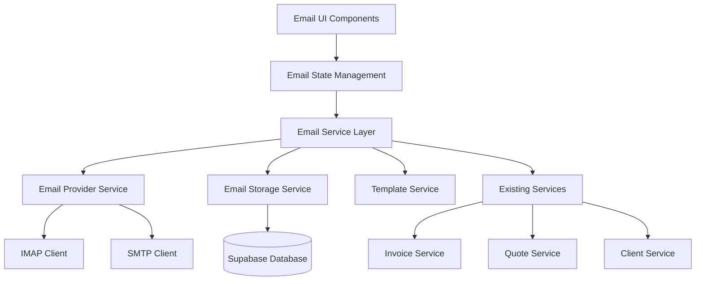

# Email Management System Documentation

## Overview

The Email Management System is a comprehensive email client integrated into Nexa Manager, providing full email functionality with business process integration. It supports multiple email accounts, advanced organization features, template management, and seamless integration with invoices, quotes, and client communications.

## Architecture

### System Components



### Service Layer Architecture

The email system follows a layered architecture pattern:

1. **UI Layer** - React components for email interface
2. **State Management** - React Context + TanStack Query for server state
3. **Service Layer** - Business logic and API integration
4. **Provider Layer** - IMAP/SMTP communication
5. **Storage Layer** - Database operations and file storage

## TypeScript Interfaces

### Core Email Types

Located in `src/types/email.ts`, the system defines comprehensive TypeScript interfaces:

#### Email Entity
```typescript
interface Email extends BaseEntity {
  message_id: string;
  thread_id?: string;
  folder_id?: string;
  account_id?: string;
  user_id: string;
  subject: string;
  sender_name: string;
  sender_email: string;
  recipients: EmailRecipients;
  content_text?: string;
  content_html?: string;
  attachments: EmailAttachment[];
  labels: string[];
  is_read: boolean;
  is_starred: boolean;
  is_important: boolean;
  is_draft: boolean;
  received_at: string;
  sent_at?: string;
  client_id?: string;
  related_documents: RelatedDocument[];
}
```

#### Email Folder Structure
```typescript
interface EmailFolder extends BaseEntity {
  name: string;
  type: 'system' | 'custom';
  icon?: string;
  color?: string;
  parent_id?: string;
  user_id: string;
  unread_count: number;
  total_count: number;
}
```

#### Email Template System
```typescript
interface EmailTemplate extends BaseEntity {
  name: string;
  category: string;
  subject: string;
  content_text: string;
  content_html?: string;
  variables: TemplateVariable[];
  is_system: boolean;
  user_id: string;
}
```

### Supporting Types

- **EmailAccount** - IMAP/SMTP account configuration
- **EmailAttachment** - File attachment handling
- **EmailComposition** - Email creation and sending
- **EmailSearchFilters** - Advanced search and filtering
- **EmailThread** - Conversation threading
- **EmailStatistics** - Analytics and reporting
- **EmailRule** - Automated email organization

## Database Schema

### Core Tables

#### emails
Stores email messages and metadata:
```sql
CREATE TABLE emails (
  id UUID PRIMARY KEY DEFAULT uuid_generate_v4(),
  message_id VARCHAR(255) UNIQUE NOT NULL,
  thread_id VARCHAR(255),
  folder_id UUID REFERENCES email_folders(id),
  account_id UUID REFERENCES email_accounts(id),
  user_id UUID REFERENCES auth.users(id) NOT NULL,
  subject TEXT NOT NULL,
  sender_name VARCHAR(255) NOT NULL,
  sender_email VARCHAR(255) NOT NULL,
  recipients JSONB NOT NULL DEFAULT '{}'::jsonb,
  content_text TEXT,
  content_html TEXT,
  attachments JSONB DEFAULT '[]'::jsonb,
  labels JSONB DEFAULT '[]'::jsonb,
  is_read BOOLEAN DEFAULT FALSE,
  is_starred BOOLEAN DEFAULT FALSE,
  is_important BOOLEAN DEFAULT FALSE,
  is_draft BOOLEAN DEFAULT FALSE,
  received_at TIMESTAMP WITH TIME ZONE NOT NULL,
  sent_at TIMESTAMP WITH TIME ZONE,
  client_id UUID REFERENCES clients(id),
  related_documents JSONB DEFAULT '[]'::jsonb,
  created_at TIMESTAMP WITH TIME ZONE DEFAULT NOW(),
  updated_at TIMESTAMP WITH TIME ZONE DEFAULT NOW()
);
```

#### email_folders
Organizes emails into folders:
```sql
CREATE TABLE email_folders (
  id UUID PRIMARY KEY DEFAULT uuid_generate_v4(),
  name VARCHAR(255) NOT NULL,
  type VARCHAR(50) CHECK (type IN ('system', 'custom')) DEFAULT 'custom',
  icon VARCHAR(100),
  color VARCHAR(7),
  parent_id UUID REFERENCES email_folders(id),
  user_id UUID REFERENCES auth.users(id) NOT NULL,
  unread_count INTEGER DEFAULT 0,
  total_count INTEGER DEFAULT 0,
  created_at TIMESTAMP WITH TIME ZONE DEFAULT NOW(),
  updated_at TIMESTAMP WITH TIME ZONE DEFAULT NOW()
);
```

#### email_accounts
Stores IMAP/SMTP account configurations:
```sql
CREATE TABLE email_accounts (
  id UUID PRIMARY KEY DEFAULT uuid_generate_v4(),
  user_id UUID REFERENCES auth.users(id) NOT NULL,
  name VARCHAR(255) NOT NULL,
  email_address VARCHAR(255) NOT NULL,
  provider VARCHAR(100),
  imap_host VARCHAR(255),
  imap_port INTEGER DEFAULT 993,
  imap_secure BOOLEAN DEFAULT TRUE,
  smtp_host VARCHAR(255),
  smtp_port INTEGER DEFAULT 587,
  smtp_secure BOOLEAN DEFAULT TRUE,
  username VARCHAR(255),
  password_encrypted TEXT,
  is_active BOOLEAN DEFAULT TRUE,
  last_sync TIMESTAMP WITH TIME ZONE,
  sync_enabled BOOLEAN DEFAULT TRUE,
  created_at TIMESTAMP WITH TIME ZONE DEFAULT NOW(),
  updated_at TIMESTAMP WITH TIME ZONE DEFAULT NOW()
);
```

### Additional Tables

- **email_templates** - Template management
- **email_attachments** - File attachment details
- **email_labels** - Custom labeling system
- **email_rules** - Automated organization rules
- **email_sync_status** - Synchronization tracking

### Security

All tables implement Row Level Security (RLS) policies:
- Users can only access their own emails and configurations
- System templates are readable by all users
- Encrypted storage for sensitive credentials

## Features

### Email Account Management

#### Multiple Account Support
- Configure multiple IMAP/SMTP accounts
- Support for popular providers (Gmail, Outlook, etc.)
- Custom server configuration
- Secure credential storage with encryption

#### Account Configuration
```typescript
const emailAccount: EmailAccount = {
  name: "Business Email",
  email_address: "business@company.com",
  provider: "gmail",
  imap_host: "imap.gmail.com",
  imap_port: 993,
  imap_secure: true,
  smtp_host: "smtp.gmail.com",
  smtp_port: 587,
  smtp_secure: true,
  sync_enabled: true
};
```

### Email Organization

#### Folder System
- **System Folders**: Inbox, Sent, Drafts, Starred, Trash
- **Custom Folders**: User-created organizational folders
- **Nested Folders**: Hierarchical folder structure
- **Folder Counts**: Real-time unread and total counts

#### Labeling System
- Custom labels with colors
- Multiple labels per email
- Label-based filtering and search
- Automated labeling with rules

### Email Composition

#### Rich Text Editor
- HTML email composition
- Text and HTML content support
- Inline image embedding
- File attachment handling

#### Template System
- Business email templates
- Variable substitution
- Category organization
- System and user templates

#### Template Variables
```typescript
const templateVariables: TemplateVariable[] = [
  {
    name: "client_name",
    label: "Client Name",
    type: "text",
    required: true,
    description: "The name of the client"
  },
  {
    name: "invoice_amount",
    label: "Invoice Amount",
    type: "number",
    required: true,
    description: "Total invoice amount"
  }
];
```

### Search and Filtering

#### Advanced Search
- Full-text search across email content
- Search by sender, recipient, subject
- Date range filtering
- Attachment-based filtering
- Label and folder filtering

#### Search Filters
```typescript
const searchFilters: EmailSearchFilters = {
  query: "invoice payment",
  folder_id: "inbox-folder-id",
  sender: "client@company.com",
  has_attachments: true,
  is_read: false,
  date_from: "2024-01-01",
  date_to: "2024-12-31",
  labels: ["important", "business"]
};
```

### Business Integration

#### Invoice Integration
- Send invoices directly from email system
- Pre-populated recipient and template
- PDF attachment handling
- Email tracking for invoice communications

#### Quote Integration
- Quote email templates
- Automated follow-up reminders
- Quote acceptance tracking
- Client communication history

#### Client Communications
- Email history per client
- Client-specific templates
- Communication timeline
- Relationship tracking

### Automation

#### Email Rules
- Automated email organization
- Condition-based actions
- Priority-based rule execution
- Multiple conditions and actions

#### Rule Configuration
```typescript
const emailRule: EmailRule = {
  name: "Invoice Emails",
  conditions: [
    {
      field: "subject",
      operator: "contains",
      value: "invoice",
      case_sensitive: false
    }
  ],
  actions: [
    {
      action: "move_to_folder",
      folder_id: "invoices-folder-id"
    },
    {
      action: "add_label",
      label_id: "business-label-id"
    }
  ],
  is_active: true,
  priority: 1
};
```

### Real-time Synchronization

#### Background Sync
- Automatic email fetching from IMAP servers
- Incremental synchronization
- Conflict resolution
- Error handling and retry logic

#### Sync Status Tracking
- Per-account sync status
- Last sync timestamps
- Error reporting
- Sync progress indicators

## API Reference

### Email Service Methods

#### Core Operations
```typescript
class EmailManagementService {
  // Email CRUD operations
  async fetchEmails(folderId: string, filters?: EmailSearchFilters): Promise<Email[]>
  async sendEmail(emailData: EmailComposition): Promise<Email>
  async deleteEmail(emailId: string): Promise<void>
  async markAsRead(emailId: string, isRead: boolean): Promise<void>
  async starEmail(emailId: string, isStarred: boolean): Promise<void>
  
  // Folder management
  async createFolder(folderData: Partial<EmailFolder>): Promise<EmailFolder>
  async updateFolder(folderId: string, updates: Partial<EmailFolder>): Promise<EmailFolder>
  async deleteFolder(folderId: string): Promise<void>
  
  // Template operations
  async getTemplates(category?: string): Promise<EmailTemplate[]>
  async saveTemplate(templateData: Partial<EmailTemplate>): Promise<EmailTemplate>
  async applyTemplate(templateId: string, variables: Record<string, any>): Promise<EmailContent>
  
  // Search and filtering
  async searchEmails(query: string, filters?: EmailSearchFilters): Promise<Email[]>
  async getEmailsByClient(clientId: string): Promise<Email[]>
  
  // Business integration
  async sendInvoiceEmail(invoiceId: string, recipientEmail: string, templateId?: string): Promise<Email>
  async sendQuoteEmail(quoteId: string, recipientEmail: string, templateId?: string): Promise<Email>
}
```

### Custom Hooks

#### useEmails
```typescript
const useEmails = (folderId?: string, filters?: EmailSearchFilters) => {
  const { data: emails, isLoading, error, refetch } = useQuery({
    queryKey: ['emails', folderId, filters],
    queryFn: () => emailService.fetchEmails(folderId, filters)
  });
  
  return { emails, isLoading, error, refetch };
};
```

#### useEmailComposer
```typescript
const useEmailComposer = () => {
  const [composition, setComposition] = useState<EmailComposition>(initialState);
  const [isSubmitting, setIsSubmitting] = useState(false);
  
  const sendEmail = async () => {
    setIsSubmitting(true);
    try {
      await emailService.sendEmail(composition);
      // Handle success
    } catch (error) {
      // Handle error
    } finally {
      setIsSubmitting(false);
    }
  };
  
  return { composition, setComposition, sendEmail, isSubmitting };
};
```

## Performance Optimization

### Email List Performance
- **Virtual Scrolling**: Handle large email lists efficiently
- **Lazy Loading**: Load email content on demand
- **Pagination**: Server-side pagination for email lists
- **Caching**: Cache frequently accessed emails

### Search Optimization
- **Full-text Indexes**: Database indexes for fast search
- **Search Caching**: Cache common search results
- **Debounced Search**: Prevent excessive API calls
- **Faceted Search**: Efficient multi-filter search

### Synchronization Performance
- **Incremental Sync**: Only sync new/changed emails
- **Background Workers**: Non-blocking sync operations
- **Batch Processing**: Process emails in batches
- **Connection Pooling**: Efficient IMAP/SMTP connections

## Security Considerations

### Data Protection
- **Encryption at Rest**: Email content and attachments encrypted
- **Credential Security**: Encrypted storage of email passwords
- **TLS Communication**: Secure IMAP/SMTP connections
- **Access Control**: RLS policies for data isolation

### Privacy Compliance
- **GDPR Compliance**: Handle personal data appropriately
- **Data Retention**: Configurable retention policies
- **Right to Deletion**: Support for data deletion requests
- **Audit Logging**: Track all email operations

## Testing Strategy

### Unit Tests
- Email service methods
- Template variable substitution
- Search and filtering logic
- Email validation functions

### Integration Tests
- IMAP/SMTP connections
- Database operations
- Business process integration
- Real-time synchronization

### End-to-End Tests
- Complete email workflows
- Template usage scenarios
- Multi-account management
- Search and organization features

## Troubleshooting

### Common Issues

#### Connection Problems
- Verify IMAP/SMTP settings
- Check firewall and network connectivity
- Validate credentials
- Review provider-specific requirements

#### Synchronization Issues
- Check sync status and error logs
- Verify account permissions
- Review rate limiting
- Monitor database performance

#### Performance Issues
- Optimize database queries
- Review email list pagination
- Check search index usage
- Monitor memory consumption

### Error Handling

The system implements comprehensive error handling:
- Connection retry with exponential backoff
- Graceful degradation for offline scenarios
- User-friendly error messages
- Detailed logging for debugging

## Future Enhancements

### Planned Features
- **Email Encryption**: End-to-end encryption for sensitive emails
- **Advanced Analytics**: Email performance metrics and insights
- **Mobile App Integration**: Native mobile email client
- **AI-Powered Features**: Smart categorization and response suggestions
- **Calendar Integration**: Meeting scheduling from emails
- **CRM Automation**: Automated lead tracking from emails

### API Extensions
- **Webhook Support**: Real-time email event notifications
- **Third-party Integrations**: Connect with external email services
- **Bulk Operations**: Mass email operations and migrations
- **Advanced Reporting**: Detailed email analytics and reports

---

For implementation details, see the [Email Management Spec](.kiro/specs/email-management/) and related documentation.