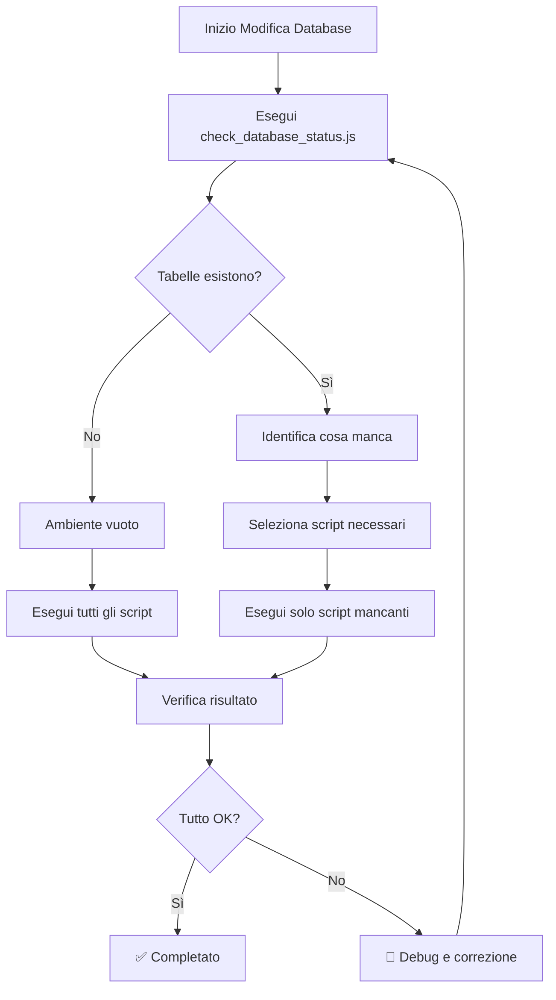

# ⚠️ REGOLA FONDAMENTALE - CONTROLLO PREVENTIVO DATABASE

## 🎯 OBIETTIVO

**PRIMA DI ESEGUIRE QUALSIASI SCRIPT SQL, DEVI SEMPRE CONTROLLARE COSA C'È GIÀ PRESENTE IN SUPABASE**

Questa regola è **OBBLIGATORIA** e **NON NEGOZIABILE** per tutti gli sviluppatori che lavorano sul progetto Nexa Manager.

## 🚨 PERCHÉ È IMPORTANTE

Il controllo preventivo evita:

- ❌ **Errori di tabelle già esistenti** (`relation already exists`)
- ❌ **Conflitti di dati** (sovrascrittura accidentale)
- ❌ **Perdita di informazioni** (drop di tabelle con dati)
- ❌ **Problemi di integrità** (vincoli duplicati)
- ❌ **Downtime non necessario** (rollback complessi)
- ❌ **Perdita di tempo** (debug di errori evitabili)

## 📋 PROCEDURA OBBLIGATORIA

### 1. ✅ CONTROLLA lo stato attuale

**Metodo Raccomandato:**
```bash
node check_database_status.js
```

**Metodo Alternativo:**
- Apri Supabase Dashboard → SQL Editor
- Esegui `check_database_status.sql`

### 2. ✅ IDENTIFICA cosa manca

Analizza l'output per capire:
- Quali tabelle esistono già
- Quali colonne sono presenti
- Quali vincoli sono attivi
- Quanti dati sono presenti

### 3. ✅ SELEZIONA solo gli script necessari

**NON eseguire mai:**
- Script per tabelle già esistenti
- Script che potrebbero sovrascrivere dati
- Script senza aver verificato le dipendenze

### 4. ✅ ESEGUI nell'ordine corretto

Segui sempre l'ordine di dipendenza:
1. Estensioni e funzioni base
2. Tabelle principali
3. Tabelle con foreign key
4. Trigger e politiche RLS
5. Dati di esempio (solo se necessario)

### 5. ✅ VERIFICA il risultato

Dopo ogni script:
- Controlla che non ci siano errori
- Verifica che le tabelle siano create correttamente
- Testa le funzionalità base

## 🛠️ STRUMENTI DISPONIBILI

### Script di Verifica

| Strumento | Descrizione | Quando usare |
|-----------|-------------|---------------|
| `check_database_status.js` | Controllo automatico completo | **SEMPRE prima di modifiche** |
| `check_database_status.sql` | Controllo manuale via SQL | Quando Node.js non è disponibile |
| Dashboard Supabase | Controllo visuale | Per verifiche rapide |

### Output del Controllo

Il controllo fornisce:
- 📋 Lista tabelle esistenti
- 👥 Numero utenti registrati
- 🗂️ Buckets storage configurati
- 📊 Conteggio record per tabella
- 🔐 Stato politiche RLS
- 📄 Report JSON dettagliato

## 🚫 COSA NON FARE MAI

### ❌ Esecuzione Cieca
```bash
# MAI FARE QUESTO!
psql -f tutti_gli_script.sql
```

### ❌ Ignorare gli Errori
```sql
-- MAI FARE QUESTO!
DROP TABLE IF EXISTS tabella_importante CASCADE;
```

### ❌ Saltare la Verifica
```bash
# MAI FARE QUESTO!
# "Sono sicuro che non c'è niente, eseguo direttamente"
```

## ✅ ESEMPI CORRETTI

### Scenario 1: Nuovo Ambiente
```bash
# 1. Verifica stato
node check_database_status.js

# Output: "Nessuna tabella trovata"
# 2. Esegui tutti gli script nell'ordine
```

### Scenario 2: Ambiente Parziale
```bash
# 1. Verifica stato
node check_database_status.js

# Output: "Trovate: profiles, roles"
# 2. Esegui solo gli script mancanti
```

### Scenario 3: Ambiente Completo
```bash
# 1. Verifica stato
node check_database_status.js

# Output: "Tutte le tabelle esistono"
# 2. NON eseguire nessuno script!
```

## 🔄 WORKFLOW COMPLETO



## 📞 SUPPORTO

Se hai dubbi o problemi:

1. **Controlla sempre** l'output del script di verifica
2. **Leggi attentamente** i messaggi di errore
3. **Non procedere** se non sei sicuro
4. **Chiedi aiuto** al team prima di rischiare

## 🎯 RICORDA

> **"Un minuto di controllo preventivo vale più di un'ora di debug"**

Questa regola esiste per proteggere il progetto e il tuo tempo. Seguila sempre!

---

**Ultima modifica:** $(date)
**Versione:** 1.0
**Stato:** OBBLIGATORIA