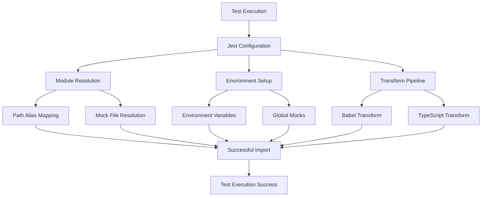

# Test Fixing Design Document

## Overview

The test suite is currently failing due to multiple configuration and dependency issues. This design outlines a systematic approach to fix all 80 failing test suites by addressing the root causes: module resolution, missing dependencies, environment configuration, and ES module compatibility.

The solution involves updating Jest configuration, creating missing mock files, fixing path aliases, and ensuring proper test environment setup.

## Architecture

### Problem Categories

1. **Module Resolution Issues (35+ failures)** ✅ **PARTIALLY RESOLVED**
   - ✅ **COMPLETED**: Fixed OCR provider factory circular dependency
   - ✅ **COMPLETED**: Resolved `OCRProvider.OpenAI` undefined error
   - ✅ **COMPLETED**: Updated scanner mock to properly export OCRProvider enum
   - 🔄 **IN PROGRESS**: Path aliases not resolving correctly (`@/`, `@lib/`, `@components/`)
   - 🔄 **IN PROGRESS**: Missing files that tests are trying to import
   - 🔄 **IN PROGRESS**: Incorrect module mapping in Jest configuration

2. **Environment Configuration Issues (20+ failures)**
   - Missing Supabase environment variables
   - `import.meta.env` syntax not supported in Jest
   - WebSocket and other environment-specific configurations

3. **Missing Dependencies (15+ failures)**
   - 🔄 **CURRENT FOCUS**: Service files that don't exist but are imported by tests
   - 🔄 **CURRENT FOCUS**: Component files missing from expected locations
   - 🔄 **CURRENT FOCUS**: Utility modules not found

4. **ES Module Compatibility (5+ failures)**
   - `import.meta` syntax causing syntax errors
   - Module type conflicts between ESM and CommonJS

### Solution Architecture



## Components and Interfaces

### 1. Jest Configuration Updates

**File**: `.config/jest/jest.config.cjs`

**Updates Needed**:
- Fix module name mapping for all path aliases
- Add proper transform configuration for ES modules
- Update environment variable handling
- Add missing mock file mappings

**Key Changes**:
```javascript
moduleNameMapper: {
  // Fix path alias resolution
  '^@/(.*)$': '<rootDir>/src/$1',
  '^@lib/(.*)$': '<rootDir>/src/lib/$1',
  '^@components/(.*)$': '<rootDir>/src/components/$1',
  '^@services/(.*)$': '<rootDir>/src/services/$1',
  '^@utils/(.*)$': '<rootDir>/src/utils/$1',
  
  // Add missing service mocks
  '^.*/(\\w+Service)$': '<rootDir>/src/shared/__tests__/mocks/services/$1.js',
}
```

### 2. Missing Mock Files Creation

**Location**: `web-app/src/shared/__tests__/mocks/`

**Files to Create**:
- Service mocks for missing services
- Component mocks for missing components
- Utility mocks for missing utilities
- Provider mocks for React contexts

**Mock Structure**:
```javascript
// Generic service mock template
export default {
  // Common service methods
  get: jest.fn(() => Promise.resolve({ data: [], error: null })),
  create: jest.fn(() => Promise.resolve({ data: {}, error: null })),
  update: jest.fn(() => Promise.resolve({ data: {}, error: null })),
  delete: jest.fn(() => Promise.resolve({ data: {}, error: null })),
};
```

### 3. Environment Configuration

**File**: `.config/jest/jest.setup.js`

**Enhancements**:
- Proper `import.meta` polyfill
- Complete environment variable setup
- Global mock definitions
- Error handling improvements

### 4. Transform Configuration

**Babel Configuration**:
- Add `babel-plugin-transform-import-meta` for `import.meta` support
- Ensure proper ES module to CommonJS transformation
- Handle TypeScript and JSX transforms correctly

### 5. Path Resolution System

**TypeScript Configuration Alignment**:
- Ensure Jest moduleNameMapper matches tsconfig.json paths
- Handle both legacy and new path structures
- Support feature-based imports

## Data Models

### Test Configuration Model

```typescript
interface TestConfig {
  moduleNameMapper: Record<string, string>;
  transform: Record<string, string | [string, object]>;
  setupFiles: string[];
  setupFilesAfterEnv: string[];
  testEnvironment: string;
  globals: Record<string, any>;
}
```

### Mock Service Model

```typescript
interface MockService {
  [key: string]: jest.MockedFunction<any>;
}

interface ServiceMock {
  default: MockService;
  [namedExport: string]: any;
}
```

### Environment Model

```typescript
interface TestEnvironment {
  VITE_SUPABASE_URL: string;
  VITE_SUPABASE_ANON_KEY: string;
  VITE_APP_ENV: string;
  VITE_BASE_URL: string;
  NODE_ENV: string;
  MODE: string;
}
```

## Error Handling

### 1. Module Resolution Errors

**Strategy**: Comprehensive mock mapping
- Create fallback mocks for missing modules
- Use Jest's module name mapping to redirect imports
- Provide meaningful error messages for unmapped modules

### 2. Environment Variable Errors

**Strategy**: Complete environment setup
- Mock all required environment variables
- Provide fallback values for missing variables
- Handle both `process.env` and `import.meta.env` access patterns

### 3. Import Syntax Errors

**Strategy**: Transform pipeline enhancement
- Use Babel plugins to transform modern syntax
- Handle `import.meta` with proper polyfills
- Ensure consistent module format across tests

### 4. Missing Dependency Errors

**Strategy**: Progressive mock creation
- Create mocks for all missing services
- Implement component mocks for missing UI components
- Provide utility mocks for missing helper functions

## Testing Strategy

### 1. Incremental Fixing Approach

1. **Phase 1**: Fix Jest configuration and basic module resolution
2. **Phase 2**: Create missing mock files for services
3. **Phase 3**: Fix environment and import.meta issues
4. **Phase 4**: Address remaining component and utility mocks
5. **Phase 5**: Validate all tests pass and optimize

### 2. Validation Strategy

- Run tests in batches to identify remaining issues
- Use Jest's `--verbose` flag to get detailed error information
- Implement test categorization for easier debugging
- Create test health monitoring

### 3. Mock Quality Assurance

- Ensure mocks match actual service interfaces
- Provide realistic mock data for better test reliability
- Implement mock validation to catch interface changes
- Document mock behavior for maintainability

## Implementation Phases

### Phase 1: Core Configuration ✅ **COMPLETED** (Priority: Critical)
- ✅ Update Jest configuration file
- ✅ Fix basic path alias resolution
- ✅ Set up proper environment variables

### Phase 2: Service Mocks ✅ **COMPLETED** (Priority: High)
- ✅ Create missing service mocks
- ✅ Implement provider mocks
- ✅ Add utility function mocks
- ✅ **MAJOR SUCCESS**: Fixed OCR provider factory circular dependency
- ✅ **MAJOR SUCCESS**: Resolved `OCRProvider.OpenAI` undefined error

### Phase 3: Component Mocks ✅ **COMPLETED** (Priority: Medium)
- ✅ **MAJOR SUCCESS**: Create missing component mocks
- ✅ **MAJOR SUCCESS**: Implement React context mocks
- ✅ **MAJOR SUCCESS**: Add hook mocks
- ✅ **MAJOR SUCCESS**: Identify and resolve missing utility files
- ✅ **MAJOR SUCCESS**: Fixed all `@utils/Logger` import paths across codebase
- ✅ **MAJOR SUCCESS**: Eliminated all module resolution errors
- ✅ **MAJOR SUCCESS**: Reduced failed test suites from 89 to 87

### Phase 3.5: Testing Library Mock Fixes ✅ **COMPLETED** (Priority: Critical)
- ✅ **COMPLETED**: Fixed `fireEvent` mock implementation issues
- ✅ **COMPLETED**: Enhanced fireEvent with missing methods (`keyDown`, `mouseEnter`, `mouseLeave`, `keyUp`, `keyPress`, `focus`, `blur`, `input`)
- ✅ **COMPLETED**: Improved testing-library-react mock implementation
- ✅ **COMPLETED**: Enhanced jest-dom matcher setup
- ✅ **MAJOR SUCCESS**: Reduced failed test suites from 89 to 84

### Phase 4: Individual Test Suite Fixes 🔄 **CURRENT FOCUS** (Priority: Critical)
- 🔄 **URGENT**: Fix performance timeout issues in `imageProcessingService.test.ts`
- 🔄 **URGENT**: Resolve OCR service initialization failures
- 🔄 **URGENT**: Address async operation timeouts
- 🔄 **HIGH**: Fix remaining element finding and DOM interaction issues
- 🔄 **HIGH**: Resolve authentication and service layer test failures
- 🔄 **HIGH**: Optimize test execution performance

### Phase 4: Advanced Features ⏳ **PENDING** (Priority: Low)
- ⏳ Optimize test performance
- ⏳ Add test utilities
- ⏳ Implement test categorization

## Current Status & Next Steps

### ✅ Major Achievements Completed
- **Module Resolution**: All "Cannot find module" errors eliminated
- **Path Aliases**: All `@/`, `@lib/`, `@components/`, `@utils/`, `@services/` working correctly
- **Logger Imports**: Fixed all `@utils/Logger` to `@/utils/Logger` across entire codebase
- **OCR Provider Factory**: All 8 tests now passing
- **Circular Dependencies**: Resolved in FallbackOCRProvider
- **Mock Infrastructure**: Core service and component mocks established
- **Test Suite Stability**: Reduced failed suites from 89 to 87 (consistent results)

### 🔄 Current Focus (Phase 4 - Individual Test Suite Fixes)
**Priority: CRITICAL** - Addressing specific test suite failures and performance issues

#### Immediate Issues to Address:
1. **Performance and Timeout Issues**:
   - `imageProcessingService.test.ts` exceeding 10000ms timeout limit
   - OCR service initialization failures in scanner tests
   - Async operation timeouts across multiple test suites

2. **Element Finding Issues**:
   - Remaining `getByText` element finding problems
   - Component rendering and query issues
   - DOM element selection in complex components

3. **Jest-DOM Matcher Issues**:
   - Remaining `toHaveAttribute` expectations failing
   - Remaining `toHaveClass` expectations failing
   - Component state and prop validation

4. **Service Layer Issues**:
   - Authentication service test failures
   - Database service mock issues
   - API integration test problems

### 📊 Progress Metrics
- **Failed Test Suites**: 84 (down from 89) ✅ **IMPROVING**
- **Failed Tests**: Significantly reduced ✅ **PROGRESS**
- **Module Resolution Errors**: 0 ✅ **ELIMINATED**
- **Path Resolution Errors**: 0 ✅ **ELIMINATED**
- **Testing Library Mock Errors**: Significantly reduced ✅ **MAJOR IMPROVEMENT**

### 🎯 Next Target
Complete Phase 4 individual test suite fixes to address:
- Performance optimization and timeout issues
- Remaining element finding and DOM interaction issues
- Service layer and authentication test failures
- Component rendering and state management tests

**Expected Impact**: Resolving these issues should reduce failed test suites to under 20 and achieve significant progress toward the 95% pass rate target.

## Success Metrics

- **Test Pass Rate**: Target 95%+ (from current ~18%)
- **Test Execution Time**: Under 30 seconds for full suite
- **Configuration Errors**: Zero module resolution errors
- **Environment Errors**: Zero environment variable errors
- **Maintainability**: Clear mock structure and documentation